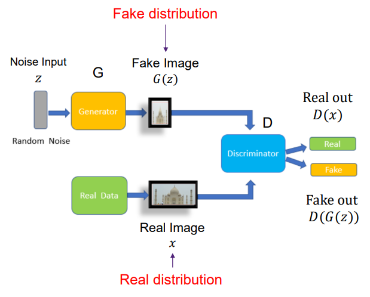
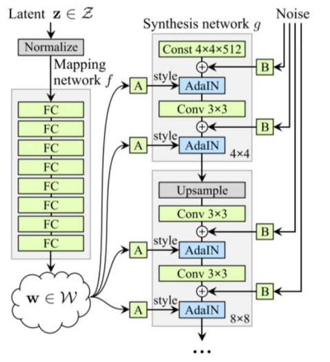
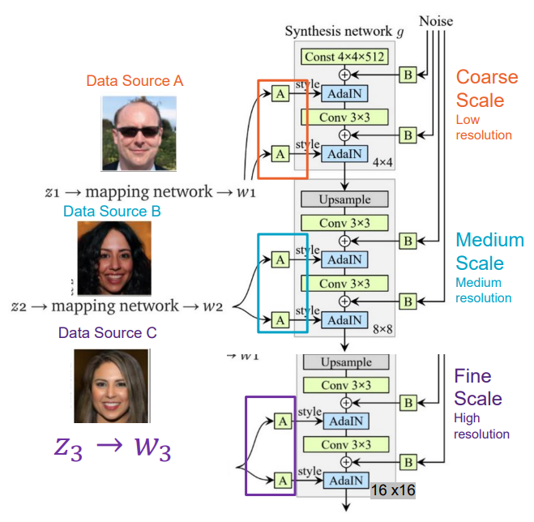
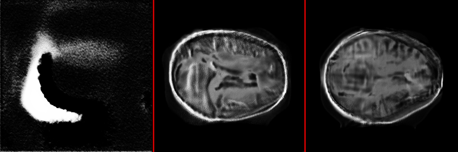
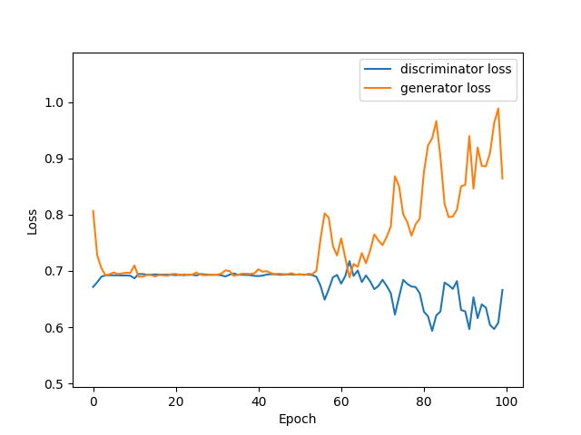

# ***Generative model of the OASIS brain dataset using StyleGAN***

## Task
For this project, I will attempt to artificially generate a “reasonably clear 
image” of an Magnetic Resonance Imaging (MRI) brain scan, where the training 
data will be that of the [OASIS brain dataset](https://www.oasis-brains.org/). 
This will be done using a Style Generative Adversarial Network (StyleGAN).

# StyleGAN Architecture
## Generative Adversarial Network (GAN)
A GAN consists of two neural networks; A Generator and a Discriminator, where 
each network will compete against each other in a zero-sum game.  

The role of the Generator network is to take a provided dataset, in this case, 
an image from the OASIS brain dataset and apply some form of random noise and 
transform the input into a resulting image which closely resembles the real 
data.

The role of the Discriminator network is to evaluate the generated image and 
attempt to distinguish it from the provided dataset. This is achieved by 
combining a sample of the dataset, containing genuine MRI brain scan images 
and generated images produced by the Generator. The Discriminator will then 
assign a score to each input which represents the likelihood of the image 
being authentic. The goal here is for the Discriminator to become increasingly 
better at determining the generated images from the authentic dataset.

Over time, both networks will improve their capabilities in both producing and 
detecting generated data and coverage to a point where the generated data is 
near indistinguishable from real data.

For a visual representation of the GAN architecture, see the image below.

## Style Generative Adversarial Network (StyleGAN)

The StyleGAN is an extension of the GAN architecture, designed with a 
higher-quality image synthesis in mind. Some of the key improvements which 
differentiate the StyleGAN from the more traditional GAN are; The StyleGAN 
is an extension of the GAN architecture, designed with a higher-quality image 
synthesis in mind. Here is a visualisation of the StyleGAN architecture.

Some of the key improvements which differentiate the 
StyleGAN from the more traditional GAN are;

## Add mapping and styles

The mapping network f introduces a mapping of random noise vectors z to 
the latent space w. This mappings allow for more control over the 
distribution of latent variables, which in turn allows for more control over 
the style of the generated images.

In this model, this is achieved by making use of an Adaptive Instance 
Normalization (AdaIN). This is a technique which allows for the modification 
of relatively important features for subsequent convolutional layers.

Here is the formula for the AdaIN;

Where, x_i is the ith channel for input x. y_s is the transformed sclae from 
w and y_b is the transformed bias from w.

Additionally, here is a visualisation of the mapping and styles components of 
the StyleGAN

## Add noise inputs

The noise inputs component of the StyleGAN introduces a noise tensor y 
which adds stochastic variation within generated using scale-specific mixing 
noise. This noise contributes to the variation and realism of the generated 
images.

Here is a visualisation of the noise inputs component of the StyleGAN

## Mixing regularization

The mixing regularization component of the StyleGAN contributes to the 
control and blend of different styles. This allows the model to sample 
multiple noise vectors from the input space. By doing this, the generator 
can improve the quality of the generated images, ultimately convincing the 
discriminator that the generated images are real.

Here is a visualisation of the mixing regularization component of the StyleGAN

# Training
## Data
The OASIS brain dataset consists of roughly 10,000 MRI brain scans with 
differing vertical slices. The complete dataset can be found on the [OASIS 
brain website](https://www.oasis-brains.org/).

## Preprocessing
The OASIS brain dataset consists of roughly 10,000 MRI brain scans, which 
have already been preprocessed. All images are grayscale and scaled to [0,
1] for computational efficiency.

## Configuration
**Batch Size:** 32 \
**Epochs:** 100 \
**Generator Learning Rate:** 0.00001 \
**Discriminator Learning Rate:** 0.0000125

# Results

## Outputs

The images shown below are the result of the StyleGAN model after training 
with the configuration above. These values were chosen as they were deemed 
appropriate for the task at hand.

Here, we can see the results of the StyleGAN model after 0, 50 and 100 
epochs to demonstrate the progression of the model.

Additionally, below are the results of the final three epochs, that is 
epochs 98, 99 and 100.

The results of the StyleGAN model above are noteworthy as the model 
"collapsed" with the results from different epochs being near identical. 
This is likely because the model was over-fitting, which is a common issue. 
A visualistion of the model collapsing can be seen below.

## Generator and Discriminator Losses
The generator and discriminator losses are plotted below.

From the graph above, we can see that the generator and discriminator begin 
to converge at around 5 epochs and diverge at around 50 epochs. 

This can be explained by the following; 

The generator and discriminator begin to converge at around 5 epochs as 
initially, the generator produces random, unrealistic images that the 
discriminator can easily distinguish from the real data.

As the generator begins to produce more realistic images, the discriminator 
begins to struggle to distinguish the generated images from the real data. 
As the discriminator becomes more accurate, the generator begins to struggle,
which we can see occurs at around 50 epochs. This divergence is likely 
caused by unfavourable hyperparameters, such as the learning rate.

Training this model took approximately 78 hours on a system with the 
following hardware;

**GPU:** NVIDIA GeForce RTX 3050 Ti Laptop (4GB GDDR6 memory).

# Usage

**Test Driver:** Predict.py

## Dependencies
Python: 3.9 \
Tensorflow: 2.14 \
Matplotlib: 3.5.1 \
Numpy: 1.26

## Hyperparameters
**Batch Size:** The number of MRI brain scan images in training batches. \
**Epochs:** The number of times the entire dataset is passed forward and 
backwards 
through the model.

*Note: The number of batches is equal to number of iterations for one epoch.*

## Variables
**INPUT_IMAGES_PATH:** The filepath to the dataset directory located in the
predict.py file. \
**INPUT_GENERATOR_WEIGHTS_PATH:** The filepath to the '.h5' files which 
contain the generator weights. By default, this will be set to "" for first 
time use.  \
**INPUT_DISCRIMINATOR_WEIGHTS_PATH:** the filepath to the '.h5' files which 
contain the discriminator weights. By default, this will be set to "" for first 
time use. \
**RESULT_IMAGE_PATH:** The filepath directory which stores the result images 
from training. By default, this will be set to "figures" \ 
**RESULT_WEIGHT_PATH:** The filepath directory which stores the result weights 
from training. By default, this will be set to "weights" \
**IMG_COUNT:** The number of images the model will produce per each epoch \
**PLOT_LOSS:** Boolean variable to produce the generator and discriminator 
loss. By default, this will be set to True.

*Note: If you're intending to train this model on the OASIS brain dataset, 
please ensure that you're abiding by the
[Data Use Agreement](https://www.oasis-brains.org/files/OASIS-3_Data_Use_Agreement.pdf)
.*

# References
1. [OASIS-1: Cross-Sectional: Principal Investigators:](https://www.oasis-brains.org/) D. Marcus, R, Buckner,
   J, Csernansky J. Morris; P50 AG05681, P01 AG03991, P01 AG026276, R01 AG021910, P20 MH071616, U24 RR021382

2. [OASIS-2: Longitudinal: Principal Investigators:](https://www.oasis-brains.org/) D. Marcus, R, Buckner, J.
   Csernansky, J. Morris; P50 AG05681, P01 AG03991, P01 AG026276, R01 AG021910, P20 MH071616, U24 RR021382

3. [OASIS-3: Longitudinal Multimodal Neuroimaging: Principal Investigators:](https://www.oasis-brains.org/) 
   T. Benzinger, D. Marcus, J. Morris; NIH P30 AG066444, P50 AG00561, P30 NS09857781, P01 AG026276, P01 AG003991, R01 AG043434, UL1 TR000448, R01 EB009352. AV-45 doses were provided by Avid Radiopharmaceuticals, a wholly owned subsidiary of Eli Lilly.

4. [OASIS-3_AV1451: Principal Investigators:](https://www.oasis-brains.org/) T. Benzinger, J. Morris; NIH 
   P30 AG066444, AW00006993. AV-1451 doses were provided by Avid Radiopharmaceuticals, a wholly owned subsidiary of Eli Lilly.

5. [OASIS-4: Clinical Cohort: Principal Investigators:](https://www.oasis-brains.org/) T. Benzinger, L. 
   Koenig, P. LaMontagne
6. [Face image generation with StyleGAN.](https://keras.io/) Author: 
   Soon-Yau Cheong, Date 
   created: 2021/07/01, Last modified: 2021/12/20
7. Epoch vs Batch Size vs Iterations, [Towards Data Science.](https://towardsdatascience.com/epoch-vs-iterations-vs-batch-size-4dfb9c7ce9c9)
8. [StyleGAN: Generative Model with Style](https://static.au.edusercontent.com/files/CyhzBAfxwI24tGGVkcVHQ6fy)
Author: Wei Dai of The University of Queensland, School of Information 
   Technology and Electrical Engineering.
9. The University of Queensland, COMP3710: Pattern Recognition and Analysis, 
   taught by [Dr Shakes Chandra, UQ Researcher](https://researchers.uq.edu.au/researcher/9654)